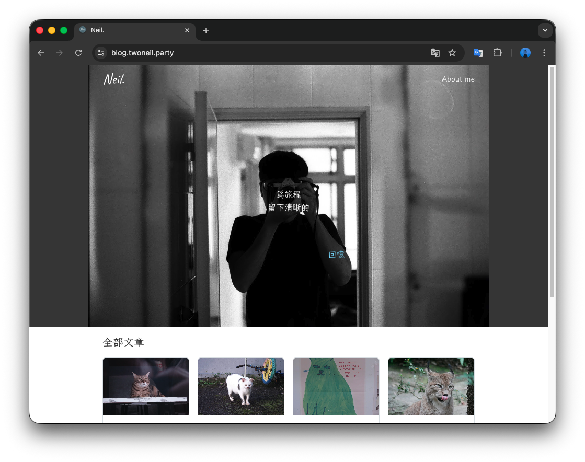
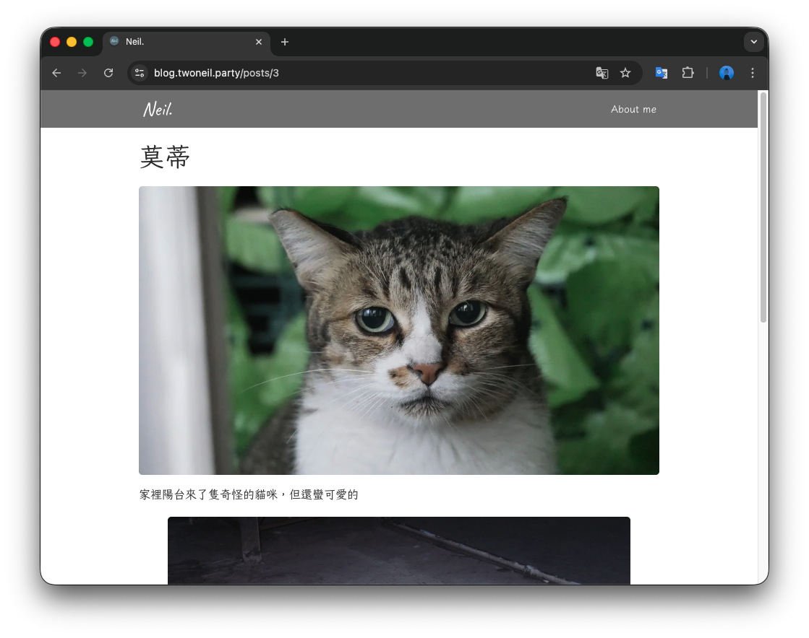
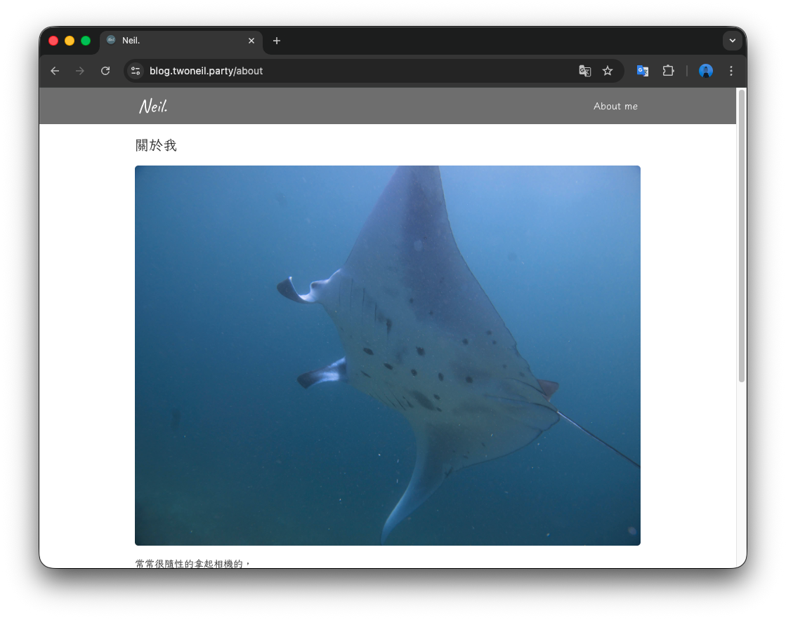

# 📙Blog

這是一個基於 React 與 Mantine UI 構建的響應式部落格，整合了 Cloudflare R2 圖片儲存與 Railway 後端 API，提供流暢的閱讀與互動體驗。

## 🛠 技術棧

- Frontend: React + Vite
- Styling: Mantine
- Form Handling: Mantine Form / zod

## ✨核心特色

- 響應式設計 (Responsive Design)：支援手機、平板與桌機，提供最佳閱讀體驗。

## 📁 專案結構

```
public              # 靜態資源（不經過 Vite 編譯）
src
├── assets          # 靜態資源 （會經過 Vite 編譯）
├── components      # UI 元件
├── pages           # 頁面級元件
├── main.jsx        # 渲染起點
├── routes.jsx      # 路由配置
├── App.css         # 應用程式入口
├── App.jsx         # 全局樣式設定
└── theme.jsx       # Mantine 主題配置
```

## 📸 界面展示 (Screenshots)

主頁面



文章頁面



關於我



## 🔑 環境變數設定（.env）

請在根目錄建立 .env 並參考以下設定：

```
# VITE_API_BASE_URL='http://localhost:3000/api'
```

## 🚀 快速啟動

1. 安裝依賴
```
npm install
```

2. 啟動專案
```
npm run dev
```
